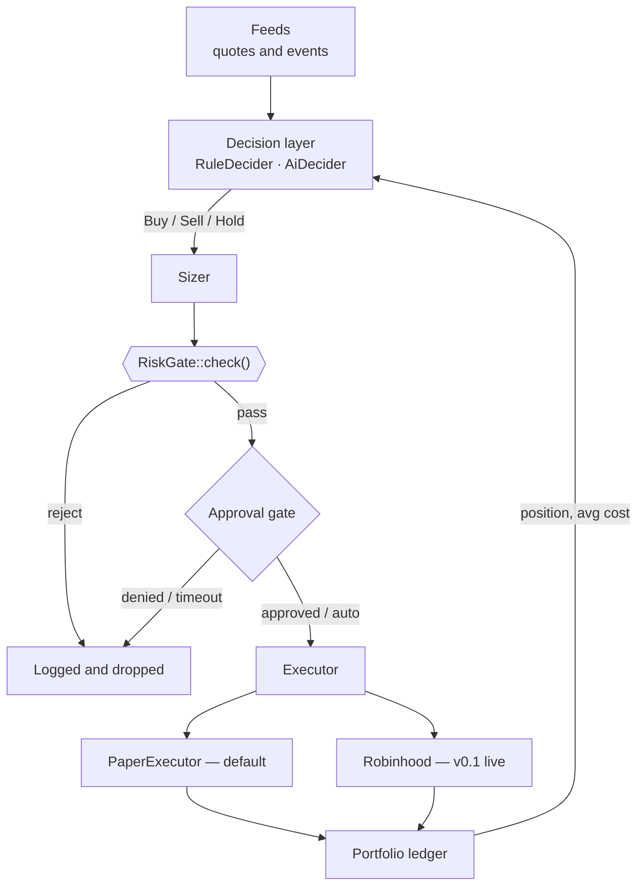

# sherwood-agent

An automated trading system for the Robinhood Agentic Trading MCP, with a hard risk gate in
front of every order.

[](https://github.com/dunksmaster/sherwood-agent/actions/workflows/ci.yml)
[](LICENSE)
[](docs/README.md)

> **Status: planning + scaffold.** No live venue is wired. The `sherwood` binary refuses any
> mode that is not `paper`, and `LiveExecutor` never fills. See
> [Project status](#project-status) and [`docs/CURRENT-STATE.md`](docs/CURRENT-STATE.md).

## Table of contents

- [Overview](#overview)
- [Scope](#scope)
- [Architecture](#architecture)
- [Repository layout](#repository-layout)
- [Prerequisites](#prerequisites)
- [Getting started](#getting-started)
- [Project status](#project-status)
- [Operator boundary](#operator-boundary)
- [Documentation](#documentation)
- [Contributing](#contributing)
- [Acknowledgements](#acknowledgements)
- [Disclaimer](#disclaimer)
- [License](#license)

## Overview

sherwood-agent proposes trades for a Robinhood Agentic account — on a schedule or in response
to a monitored event — using a decision layer that can be deterministic rules, a language
model, or both. Every proposal clears a risk gate and a set of spend caps before anything
reaches a venue. In manual mode you approve each order; in auto mode it executes within
configured limits. A local dashboard shows the portfolio, an activity feed, pending
approvals, and a kill switch, and every decision, order, and fill is written to a
tamper-evident audit log.

Paper trading is the default. Live requires the venue connected, the admin role, and an
explicit toggle.

## Scope

| Milestone | Venue | What it does |
|---|---|---|
| **v0.1** (current target) | Robinhood Agentic Trading MCP | AI-assisted order automation on a Robinhood Agentic account. OAuth — no wallets, no private keys. Dashboard, scheduler, tamper-evident audit. |
| **v0.2** (later, same repo) | Solana | Adds on-chain modules — chain client, key custody tiers, wallets, sniper, copy-trade — behind the same `Executor` and feed traits. Additive, not a rewrite. |

The `sniper` and `copytrade` crates exist today as tested library scaffolding. They are
**not wired into the runner** and are deferred to v0.2.

## Architecture

Every strategy, every decider, and every venue funnels through the **same** `RiskGate`. A
misbehaving strategy — or a model returning nonsense — can only do as much damage as the gate
permits.



Full detail, including the event bus and error taxonomy, is in
[`docs/ARCHITECTURE.md`](docs/ARCHITECTURE.md).

## Repository layout

```
sherwood-agent/
├── crates/
│   ├── core/         domain types, Portfolio, RiskGate, Clock, PriceFeed  (no I/O)
│   ├── store/        SQLite persistence + hash-chained audit log (sqlx)
│   ├── events/       internal event bus (broadcast) + Subscriber trait
│   ├── secrets/      encrypted file vault (Argon2id + XChaCha20-Poly1305)
│   ├── execution/    Executor trait, PaperExecutor, LiveExecutor stub, PreToolUse hook gate
│   ├── decision/     Decider trait, RuleDecider, AiDecider
│   ├── server/       local control-plane HTTP API (axum, loopback, bearer auth)
│   ├── copytrade/    library scaffold — deferred to v0.2
│   ├── sniper/       library scaffold — deferred to v0.2
│   └── cli/          the `sherwood` binary
├── frontend/         React + Vite + TS control-plane dashboard
├── deploy/           Prometheus scrape + alert rules, Grafana dashboard JSON
├── Dockerfile        multi-stage build → debian:slim runtime (see docs/DEPLOYMENT.md)
├── docker-compose.yml
├── .sqlx/            committed sqlx offline query cache (CI uses this)
├── docs/             the plan, standards, security, ADRs — start at docs/README.md
├── feeds/            sample CSV price feeds for `sherwood run --feed_path`
├── config.example.toml
└── rust-toolchain.toml
```

Planned crates (not yet written): `config`, `supervisor`, `runtime`, plus a
`frontend/`. See [`docs/ROADMAP.md`](docs/ROADMAP.md).

## Prerequisites

| # | Requirement | Version | Get it |
|---|---|---|---|
| 1 | Rust toolchain | **1.80+** (stable) | <https://rustup.rs> |
| 2 | C++ build tools (Windows) | VS 2022 Build Tools, "Desktop development with C++" | <https://visualstudio.microsoft.com/downloads/> |
| 3 | C toolchain (Linux) | `build-essential` / `clang` + `pkg-config` | your distro's package manager |

The toolchain is pinned in [`rust-toolchain.toml`](rust-toolchain.toml); `rustup` installs
the right version automatically on first build.

> **Windows:** build from **PowerShell**, not Git Bash. Git Bash's coreutils `link` shadows
> the MSVC linker and produces a confusing "extra operand" error.

## Getting started

```bash
# 1. Clone
git clone https://github.com/dunksmaster/sherwood-agent
cd sherwood-agent

# 2. Test
cargo test

# 3. Run the built-in two-symbol demo feed through
#    RuleDecider → RiskGate → PaperExecutor, printing the ledger
cargo run -p sherwood-cli -- demo

# 4. Configure
cp config.example.toml config.toml
cargo run -p sherwood-cli -- check config.toml

# 5. Run against the config (paper only). Set `feed_path` to replay a CSV
#    (timestamp,symbol,price) and `state_path` to persist + resume. Set
#    `[general] decider = "ai"` (+ the `[ai]` section) to drive it with a
#    language model instead of the rules — still paper, still gated.
cargo run -p sherwood-cli -- run config.toml

# 5b. Backtest the same feed and print performance metrics (see docs/BACKTEST.md)
cargo run -p sherwood-cli -- backtest config.toml

# 5c. Back up the state DB + vault (stop `serve`/`run` first; see docs/RUNBOOK.md)
cargo run -p sherwood-cli -- backup config.toml ./backups

# 6. Or start the local control-plane API (loopback, bearer token minted into
#    the vault on first run). Exposes /v1/health and the PreToolUse order gate.
cargo run -p sherwood-cli -- serve config.toml
```

`demo` replays a synthetic two-symbol series — a wiring demonstration, not a backtest. A
real backtest harness and a live feed are still ahead; see
[`docs/CURRENT-STATE.md`](docs/CURRENT-STATE.md).

## Project status

**v0.1 (paper) — feature complete.** 163 Rust tests pass, the dashboard builds, CI is green,
and the [threat model is signed off](docs/THREAT-MODEL.md#sign-off). Cutting the `v0.1.0`
tag is the operator's call — see [RELEASE-NOTES-0.1.0.md](docs/RELEASE-NOTES-0.1.0.md). There
is **no live-venue path** in v0.1; the Robinhood MCP adapter and everything downstream of it
is v0.2.

- **Done (S0–S6):** the S0 doc set; a tested `core` with `RiskGate` and `Portfolio`; a
  deterministic paper executor; a rule decider and a language-model decider (strict-JSON
  output, injection guard, fallback-to-Hold); SQLite persistence with a hash-chained audit
  log; an internal event bus; a multi-asset paper loop over a CSV feed; an encrypted secrets
  vault.
- **Done (S7 core, S9, S11a):** the fail-closed `PreToolUse` hook decision core
  ([ADR-0001](docs/adr/0001-mcp-interaction-model.md) Option 3); `sherwood-server` on
  loopback — bearer auth, 3 RBAC roles, error envelope, kill switch, PAPER/LIVE toggle,
  `/v1/metrics`, rate limit, and read-only portfolio / activity / audit-verify views.
- **Done (S10, S11, S12a, S14a):** the `frontend/` dashboard (token login, PAPER/**LIVE**
  badge, portfolio + activity + approvals views, kill-switch and mode toggle); the
  human-in-the-loop **approval gate**; per-session **spend budgets**; and `sherwood
  backtest` with total return / drawdown / win rate / profit factor / expectancy.
- **Done (S13a, S15):** `/v1/metrics` + `deploy/` (Prometheus/Grafana), rolling JSON logs,
  `sherwood backup`/`restore`, `RUNBOOK.md`, a multi-stage `Dockerfile`, `DEPLOYMENT.md`,
  and the threat-model sign-off. **S9e closed** — `docs/API.md` is the API contract; no
  generated OpenAPI ([why](docs/DECISIONS.md#2026-09-04)).
- **Remaining for release (S16):** `git tag -a v0.1.0` + push + a GitHub release. Prepped:
  release notes, the CHANGELOG `[0.1.0]` section, SBOM in CI.
- **Deferred to v0.2:** the Robinhood MCP adapter + OAuth + reconciliation + session
  reconnection (S7.4–S8); the cron scheduler / live-feed monitors (S12b); A/B backtest
  (S14b); Solana modules.

Roadmap and step list: [`docs/ROADMAP.md`](docs/ROADMAP.md). Component-by-component audit:
[`docs/CURRENT-STATE.md`](docs/CURRENT-STATE.md).

Once a dashboard exists, this README will grow a screenshot-driven walkthrough of each
feature. It does not have one yet because there is nothing to show.

## Operator boundary

This project does not, and will not, do these on your behalf:

- Open or authenticate a Robinhood Agentic account, or run `claude mcp add`.
- Accept the Robinhood Crypto customer agreement or the agentic disclosures.
- Hold your credentials, or place a live order without you enabling live mode.

You do those. See [`docs/LIVE_EXECUTION.md`](docs/LIVE_EXECUTION.md).

## Documentation

Start at [`docs/README.md`](docs/README.md) for the indexed set. Entry points:

| Document | What it covers |
|---|---|
| [ROADMAP.md](docs/ROADMAP.md) | Phases, steps S0–S16, MVP definition, non-goals, v0.2 outline |
| [ARCHITECTURE.md](docs/ARCHITECTURE.md) | Crate map, data flow, event bus, error taxonomy |
| [DECISIONS.md](docs/DECISIONS.md) | ADR index and the decision log |
| [ENGINEERING-STANDARDS.md](docs/ENGINEERING-STANDARDS.md) | Lints, MSRV, determinism, testing, CI gates |
| [SECURITY.md](docs/SECURITY.md) · [THREAT-MODEL.md](docs/THREAT-MODEL.md) · [AI-SAFETY.md](docs/AI-SAFETY.md) | Security architecture, STRIDE, prompt-injection defence |
| [LICENSING.md](docs/LICENSING.md) · [PRIOR-ART.md](docs/PRIOR-ART.md) | Clean-room policy and provenance trail |

## Contributing

Contributions are welcome; the bar is high because this trades a funded account. Read
[`CONTRIBUTING.md`](CONTRIBUTING.md) first — it carries the review checklist and a
**Contributor Licence Agreement** that every PR accepts by submission.

## Acknowledgements

Design concepts were studied from several projects — **OpenTrade-Agent** (the Robinhood
harness pattern), **barter-rs** and **NautilusTrader** (event-driven trait design),
**freqtrade** (strategy and protection patterns), among others. No source code from any
non-permissively-licensed project is used here. The full list, with licences and a
"code used" column, is [`docs/PRIOR-ART.md`](docs/PRIOR-ART.md).

## Disclaimer

Experimental software, provided as-is, without warranty. **Not financial, investment, or
trading advice.** Automated strategies — especially ones with a language model in the loop —
can lose the entire account. You are responsible for configuring, supervising, and bearing
the consequences of anything you run.

## License

[MIT](LICENSE) — but see [`docs/LICENSING.md`](docs/LICENSING.md) before assuming that is
final.
