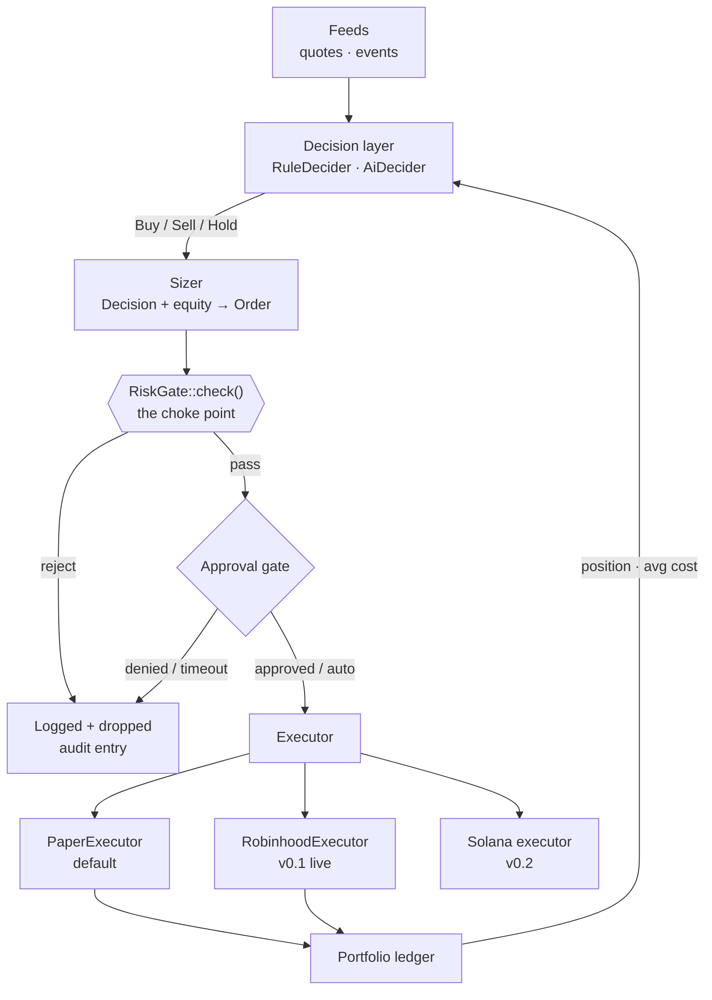

# Architecture

## The invariant

Every order — from any strategy, any decider, any venue — passes through exactly one
`RiskGate::check` before any executor sees it. Nothing bypasses it. This is the single
property the whole design exists to protect.

## Crate map

### Shared core — v0.1

| Crate | Responsibility | Depends on |
|---|---|---|
| `sherwood-core` | Domain types, `Portfolio`, `RiskGate`, spend controls, `Clock` and `PriceFeed` traits. **No I/O.** | — |
| `sherwood-events` | Internal async bus. Every component publishes and subscribes; nothing calls another component directly. | `core` |
| `sherwood-store` | SQLite persistence behind a `Store` trait: portfolio snapshots, fill history, hash-chained audit log. Config / cursors / approvals tables land at S2 / S5 / S11. See [DATA-MODEL.md](DATA-MODEL.md). | `core` |
| `sherwood-config` | Typed configuration, validated bounds, versioning, change broadcast. | `core`, `events` |
| `sherwood-secrets` | Credential vault — OS keyring or `age`. Config holds references; values resolve at runtime. | — |
| `sherwood-decision` | `Decider` trait, `RuleDecider`, `AiDecider`, provider adapters. | `core` |
| `sherwood-execution` | `Executor` trait, `PaperExecutor`, `RobinhoodExecutor`, MCP client. | `core`, `secrets` |
| `sherwood-supervisor` | Config-driven component lifecycle: `start`, `stop`, `health_check`. Shared quota manager. | all above |
| `sherwood-runtime` | Scheduler, event monitors, approval gate, run budgets. Modules, not separate crates. | `core`, `events`, `store` |
| `sherwood-server` | axum REST + WebSocket, auth, RBAC, PAPER/LIVE flag, `/metrics`. | all above |
| `sherwood-cli` | `sherwood` binary — `demo`, `run`, `check`, `serve`. | all above |
| `frontend/` | React + Vite + shadcn/ui dashboard, served by the server. | — |

### Deferred to v0.2

`sherwood-chain` · `sherwood-signer` · `sherwood-wallets` · `sherwood-router`, plus wiring
the existing `sherwood-sniper` and `sherwood-copytrade` crates to live feeds.

## Dependency rule

Dependencies point inward. `core` depends on nothing. Nothing depends on `cli` or `server`.
A crate may not depend on a sibling at the same layer — they communicate through
`sherwood-events`.

## Event bus

Components are decoupled through a bounded tokio `broadcast` channel. Consequences:

- Adding a strategy is one config entry plus one trait implementation. No wiring changes.
- The audit log is **one subscriber**. So are metrics, notifications, and the WebSocket feed.
- Splitting into separate services later means swapping the bus implementation, not
  rewriting callers.

Core event types (each carries a `version: u16` — see `RUNTIME.md`, filled at S3):

`MarketSnapshotReceived` · `DecisionMade` · `OrderProposed` · `RiskChecked` ·
`ApprovalRequested` · `ApprovalResolved` · `OrderSubmitted` · `OrderStatusChanged` ·
`OrderExecuted` · `PortfolioUpdated` · `KillSwitchToggled` · `ConfigChanged` ·
`SessionStateChanged` · `BackpressureWarning`

**Backpressure policy:** bounded at 1000. On overflow the oldest events are dropped and a
`BackpressureWarning` is emitted. The audit subscriber is the exception — audit writes are
synchronous on the critical path, because a dropped audit entry is a correctness failure.

## Error taxonomy

Every fallible operation classifies its error. The classification, not the call site,
decides the response.

| Class | Meaning | Response |
|---|---|---|
| `Transient` | Network blip, HTTP 429, 5xx, timeout | Retry with exponential backoff and jitter, up to a budget |
| `Fatal` | HTTP 401/403, revoked grant, malformed contract | Halt the component, emit `SessionStateChanged`, require operator action |
| `Rejected` | The venue understood and refused — insufficient buying power, market closed, PDT limit | Do not retry. Record, surface to the operator, continue |
| `Invariant` | Our own bug — gate returned an impossible state, ledger disagrees with the venue | Halt everything. Engage the kill switch. This is never retried |

`Transient` and `Rejected` are recoverable; `Fatal` needs a human; `Invariant` is a stop-the-
world. The mapping from Robinhood's specific errors lands in `ROBINHOOD-API.md` at S7.

## Determinism

Backtest, paper, and live run the **same** strategy and gate code. This only holds if nothing
in that path reads ambient state. Therefore:

- Time comes from an injected `Clock` trait, never `Utc::now()` inside strategy or gate code.
- Randomness comes from an injected seeded RNG.
- All I/O sits behind a trait with a test double.

A test that calls `Utc::now()` in an assertion is a bug.

## Configuration and secrets

`config.toml` holds structure and **references** to secrets, never values. At load time
`sherwood-secrets` resolves each reference from the OS keyring or an `age`-encrypted file.
Resolved values are held in memory for the minimum necessary lifetime, never logged, never
returned over the HTTP API, and never written to the store.

## Mode gating

`PAPER` is the default and the only mode the current binary permits. `LIVE` requires all of:
the venue session connected, the `admin` role, an explicit toggle through the API, and — for
the first live order — manual approval regardless of the configured approval mode.

## Open architectural decisions

- **[ADR-0001](adr/0001-mcp-interaction-model.md)** — how sherwood talks to the Robinhood
  MCP. Status **proposed**. This blocks S7 and shapes whether `sherwood-decision` is on the
  v0.1 critical path at all.
- **[ADR-0002](adr/0002-ai-decision-mode.md)** — AI advisory versus AI on the decision path.
  Status **proposed**.
