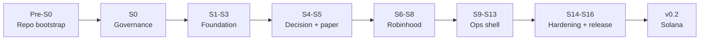

# Roadmap

## Direction

**v0.1 targets the Robinhood Agentic Trading MCP only.** No Solana, no wallets, no private
keys — Robinhood authenticates over OAuth and custodies the assets.

**v0.2 adds Solana** as additive modules in this same repository, behind the same `Executor`
and feed traits. It is not a rewrite.

The two are kept in one repo because the core — types, `RiskGate`, `Portfolio`, decision
layer, server, dashboard, approvals, scheduler, audit — is shared. Only the venue adapters
differ, and those are already isolated behind traits.

## MVP — v0.1

An AI decision layer proposes trades for your Robinhood Agentic account, on a schedule or in
response to a monitored event. Every proposal clears the `RiskGate` and the spend caps. In
**manual mode** you approve each order; in **auto mode** it executes within configured
limits. A local dashboard shows portfolio, activity, pending approvals, and a kill switch.
Every decision, order, and fill is written to a tamper-evident audit log.

Paper is the default. Live requires the MCP connected, the admin role, and an explicit
toggle.

### Explicitly not in v0.1

Solana · sniper · copy-trading · multi-user · cloud or multi-node deployment · dynamic
strategy plugin loading · HSM or hardware custody · compliance tooling.

## Phases

Each phase gates the next. **No code is written until S0 is complete and reviewed.**

## Pre-S0 — repo bootstrap

| Step | Task |
|---|---|
| P0.1 | Decide repository visibility (see [SECURITY.md](SECURITY.md#disclosure-posture)) |
| P0.2 | Branch protection on `main`: require PR, green CI, no direct push |
| P0.3 | Issue templates — bug, feature, security |
| P0.4 | PR template with the review checklist |
| P0.5 | `CODEOWNERS` |
| P0.6 | `.deny.toml` — allow MIT/Apache-2.0/BSD/ISC/Zlib, ban GPL/AGPL/LGPL/ELv2, check advisories |
| P0.7 | Renovate or Dependabot configuration |
| P0.8 | Pre-commit hooks: `gitleaks`, `cargo fmt`, `cargo clippy` |

## S0 — governance

| Step | Task | Output |
|---|---|---|
| S0.1 | Engineering standards, including the workspace lint manifest and pinned MSRV | `ENGINEERING-STANDARDS.md` |
| S0.2 | Security architecture and policy | `SECURITY.md` |
| S0.3 | Threat model — STRIDE plus MCP- and AI-specific threats | `THREAT-MODEL.md` |
| S0.4 | AI safety — prompt injection, output schema, budgets, provenance | `AI-SAFETY.md` |
| S0.5 | Contribution process and CLA | `CONTRIBUTING.md` |
| S0.6 | Licence strategy and provenance trail | `LICENSING.md`, `PRIOR-ART.md` |
| S0.7 | ADRs 0001–0003 seeded | `adr/` |
| S0.8 | Robinhood integration facts gathered | `ROBINHOOD-API.md` |
| S0.9 | CI workflow: fmt · clippy · test · deny · audit · SBOM · gitleaks · doc-link | `.github/workflows/ci.yml` |
| S0.10 | README rewritten for the v0.1 scope | `README.md` |

**Exit criteria:** ADR-0001 accepted. All Tier-1 docs written. CI gates green on a no-op PR.

## S1–S3 — foundation

| Step | Task | Crate |
|---|---|---|
| S1.1 | Schema: `portfolio_snapshots`, `fills`, `audit_log`, `cursors`, `config_state`, `pending_approvals` | `store` |
| S1.2 | `Store` trait — append-only guarantee for the audit table | `store` |
| S1.3 | `SqliteStore` via `sqlx` with compile-time query checking | `store` |
| S1.4 | Hash-chained audit log — each row carries `prev_hash` and `hash = sha256(prev_hash ‖ data)` | `store` |
| S1.5 | External anchoring hook (no-op stub for v0.1) | `store` |
| S1.6 | `Portfolio` round-trip serialization, property-tested | `core`, `store` |
| S2.1 | `AppConfig` with real validation — range checks, overlap checks, actionable errors | `config` |
| S2.2 | Config reload via `notify`, broadcasting a change event | `config` |
| S2.3 | Config schema versioning with migration stubs | `config` |
| S2.4 | Secret references resolved at load time, never stored inline | `config` |
| S3.1 | Event bus — tokio `broadcast`, bounded at 1000, documented backpressure policy | `events` |
| S3.2 | Core event types, each carrying a `version` field | `events` |
| S3.3 | `EventBus` trait plus the tokio implementation; audit log becomes one subscriber | `events` |
| S3.4 | `Supervisor` trait — `start`, `stop`, `health_check` | `supervisor` |
| S3.5 | Config-driven component startup | `supervisor` |

## S4–S5 — decision layer and the paper loop

| Step | Task | Crate |
|---|---|---|
| S4.1 | `Decider` registry — name to factory | `decision` |
| S4.2 | `AiProvider` trait returning strict JSON | `decision` |
| S4.3 | `NvidiaDecider` — `reqwest`, timeout, retry, token budget | `decision` |
| S4.4 | Claude and Groq adapter stubs | `decision` |
| S4.5 | Output schema enforcement and the fallback chain (see [AI-SAFETY.md](AI-SAFETY.md)) | `decision` |
| S4.6 | Prompt template structure — system prompt, market context, rules, output schema | `decision` |
| S4.7 | Shared AI quota manager | `supervisor` |
| S5.1 | `PriceFeed` trait plus a CSV implementation | `core` |
| S5.2 | Multi-asset runner — iterate configured assets, remove the `"ROAR"` hardcode | `cli` |
| S5.3 | End-to-end loop over the event bus: feed → decider → gate → executor → store | `cli` |
| S5.4 | `RiskGate` extension: unrealized-loss limit, max open positions, per-asset daily volume, cooldown | `core` |
| S5.5 | Kill switch wired — bus event plus gate check | `core`, `cli` |
| S5.6 | Graceful shutdown — SIGINT, flush state, exit | `cli` |
| S5.7 | Deterministic harness — injected `Clock`, seeded RNG | `core`, `cli` |

**Exit criteria:** a multi-asset paper run from a CSV feed, with state persisted across a
restart and a verifiable audit chain.

## S6–S8 — Robinhood integration

| Step | Task | Crate |
|---|---|---|
| S6.1 | `SecretsVault` trait | `secrets` |
| S6.2 | OS keyring implementation | `secrets` |
| S6.3 | `age` file-based implementation | `secrets` |
| S6.4 | Local API token generated on first run | `secrets` |
| S7.1 | MCP client per [ADR-0001](adr/0001-mcp-interaction-model.md) | `execution` |
| S7.2 | **Tool allowlist** — only named MCP tools may be invoked, everything else refused | `execution` |
| S7.3 | `RobinhoodExecutor` — place, cancel, status | `execution` |
| S7.4 | Order-status reconciliation against the agentic order ledger | `execution` |
| S7.5 | Portfolio, positions, and quote reads | `execution` |
| S7.6 | Error taxonomy — retryable vs fatal, mapped to `ExecError` | `execution` |
| S7.7 | Rate-limit handling | `execution` |
| S8.1 | Session state machine — disconnected → connecting → connected → active → stale | `execution` |
| S8.2 | Silent reconnect with exponential backoff | `execution` |
| S8.3 | Fail-closed: no new orders when the session has been down beyond a threshold | `execution` |
| S8.4 | Supersede logic for a replaced session | `execution` |

## S9–S13 — ops shell

| Step | Task | Crate |
|---|---|---|
| S9 | `sherwood-server`: axum REST `/v1/` with `utoipa`, WebSocket feed, local-token auth (constant-time compare), RBAC middleware, PAPER/LIVE toggle, `/metrics`, localhost-only CORS, rate limiting | `server` |
| S10 | Dashboard: React + Vite + shadcn/ui — auth, config, portfolio, activity feed, PAPER/LIVE badge, kill-switch button | `frontend/` |
| S11 | Approval gate: state machine (proposed → pending → approved → executed → settled, or denied), WebSocket push, order cards with the AI's reasoning, manual and auto modes, auto-deny timeout, revocation before execution | `runtime` |
| S12 | Scheduler and monitors: `tokio-cron-scheduler`, timezone handling, price-threshold monitors, per-run budgets (max orders, max notional, max duration) with hard stops | `runtime` |
| S13 | Notifications and observability: OS notifications, audit feed UI with hash verification, Grafana dashboards, alert rules, log rotation | `runtime`, `server` |

## S14–S16 — hardening and release

| Step | Task |
|---|---|
| S14 | Backtest and replay: historical quote loader, deterministic replay with injected clock, metrics (P&L curve, max drawdown, hit rate, profit factor, expectancy), A/B comparison of deciders |
| S15 | Reconnect and backoff stress tests, Docker image and compose stack, `sherwood backup` / `sherwood restore`, `RUNBOOK.md`, threat-model sign-off |
| S16 | v0.1 release — signed tag, SBOM, release notes |

## v0.2 — Solana modules

| Milestone | Crate |
|---|---|
| v0.2.1 | `sherwood-chain` — Solana RPC abstraction |
| v0.2.2 | `sherwood-signer` — custody tiers, signer isolation |
| v0.2.3 | `sherwood-wallets` — multi-wallet registry, per-strategy binding, spend ceilings |
| v0.2.4 | `sherwood-sniper` — pool event source, Geyser feed, live `RugScreen` |
| v0.2.5 | `sherwood-copytrade` — leader feed, swap decoding |
| v0.2.6 | `sherwood-router` — venue selection by notional and risk |

## Beyond v0.2

Postgres or TimescaleDB · NATS or Redis event backbone · HSM/KMS and MPC custody · real
multi-user RBAC · shadow mode (live logic, live data, no orders) · compliance tooling ·
non-LLM signal models · remote control app.
