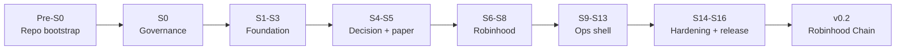

# Roadmap

> **v0.1 shipped (2026-09-04).** S0–S16 done for a **paper** release: `v0.1.0`
> [tagged and released](https://github.com/dunksmaster/sherwood-agent/releases/tag/v0.1.0).
> See [RELEASE-NOTES-0.1.0.md](RELEASE-NOTES-0.1.0.md). S9e is closed (no
> generated OpenAPI).
>
> **v0.2 re-targeted (2026-09-04):** live venue is now Robinhood Chain, not the
> Agentic MCP (US/EEA-gated) and not Solana —
> [ADR-0006](adr/0006-robinhood-chain-venue.md). Rows marked *deferred* /
> *pending* below are v0.2.

## Direction

**v0.1 targets the Robinhood Agentic Trading MCP** (paper only). No wallets, no private
keys — Robinhood authenticates over OAuth and custodies the assets. This stays the
documented path for anyone who has that MCP.

**v0.2's live venue is Robinhood Chain** — Robinhood's permissionless Ethereum L2 (chain id
`4663`), traded through Uniswap v4 from a self-custody wallet. This replaces the earlier
"v0.2 adds Solana" plan: the Agentic MCP is US/EEA-gated and unavailable to the operator,
whereas Stock Token transfers on Robinhood Chain were verified permissionless at the token
contract ([ADR-0006](adr/0006-robinhood-chain-venue.md),
[`scripts/rhc-probe.mjs`](../scripts/rhc-probe.mjs)). The Solana module *shapes* (RPC
abstraction, signer isolation, wallet registry, router) carry over to EVM; only the chain
client and swap construction are new.

Both venues live in one repo because the core — types, `RiskGate`, `Portfolio`, decision
layer, server, dashboard, approvals, scheduler, audit — is shared and venue-agnostic. Only
the adapters differ, and those are already isolated behind traits.

## MVP — v0.1

An AI decision layer proposes trades for your Robinhood Agentic account, on a schedule or in
response to a monitored event. Every proposal clears the `RiskGate` and the spend caps. In
**manual mode** you approve each order; in **auto mode** it executes within configured
limits. A local dashboard shows portfolio, activity, pending approvals, and a kill switch.
Every decision, order, and fill is written to a tamper-evident audit log.

Paper is the default. Live requires the MCP connected, the admin role, and an explicit
toggle.

### Explicitly not in v0.1

On-chain execution · wallet custody / private keys · sniper · copy-trading · multi-user ·
cloud or multi-node deployment · dynamic strategy plugin loading · HSM or hardware custody ·
compliance tooling. (On-chain execution is v0.2 — [ADR-0006](adr/0006-robinhood-chain-venue.md).)

## Phases

Each phase gates the next. **No code is written until S0 is complete and reviewed.**

## Pre-S0 — repo bootstrap

Also the hygiene half of the [grade target](GRADE-TARGET.md) — these lift the process
dimensions of the rubric without any architecture work. The `H` labels are cross-referenced
from `GRADE-TARGET.md`.

| Step | Task | Grade item |
|---|---|---|
| P0.1 | ~~Decide repository visibility~~ — **public** (2026-09-04), open-source project | — |
| P0.2 | ~~Branch protection on `main`~~ — **done:** PR required, all CI checks required (strict), linear history, no force-push, no deletion, `enforce_admins = false` so the owner can hotfix in an emergency | H4 |
| P0.3 | Issue templates — bug, feature, security | — |
| P0.4 | PR template with the review checklist | H4 |
| P0.5 | `CODEOWNERS` | H4 |
| P0.6 | `.deny.toml` — allow MIT/Apache-2.0/BSD/ISC/Zlib, ban GPL/AGPL/LGPL/ELv2, check advisories | H3 |
| P0.7 | Renovate or Dependabot configuration | H2 |
| P0.8 | Pre-commit hooks: `gitleaks`, `cargo fmt`, `cargo clippy` | H3 |
| P0.9 | Remove `Cargo.lock` from `.gitignore` and commit it | H1 |
| P0.10 | `#![forbid(unsafe_code)]` + `[workspace.lints]` in the root `Cargo.toml` | H5 |
| P0.11 | `CHANGELOG.md` and tag `v0.0.1` | H6 |
| P0.12 | `cargo-llvm-cov` coverage reported in CI | H7 |
| P0.13 | `CLAUDE.md` for the repo | H8 |
| P0.14 | Config validation (defect 10) and graceful shutdown (defect 9) — small, real code | H9 |

## S0 — governance

| Step | Task | Output |
|---|---|---|
| S0.1 | Engineering standards, including the workspace lint manifest and pinned MSRV | `ENGINEERING-STANDARDS.md` |
| S0.2 | Security architecture and policy | `SECURITY.md` |
| S0.3 | Threat model — STRIDE plus MCP- and AI-specific threats | `THREAT-MODEL.md` |
| S0.4 | AI safety — prompt injection, output schema, budgets, provenance | `AI-SAFETY.md` |
| S0.5 | Contribution process and CLA | `CONTRIBUTING.md` |
| S0.6 | Licence strategy and provenance trail | `LICENSING.md`, `PRIOR-ART.md` |
| S0.7 | ADRs 0001–0003 seeded | `adr/` |
| S0.8 | Robinhood integration facts gathered | `ROBINHOOD-API.md` |
| S0.9 | CI workflow: fmt · clippy · test · deny · audit · SBOM · gitleaks · doc-link | `.github/workflows/ci.yml` |
| S0.10 | README rewritten for the v0.1 scope | `README.md` |

**Exit criteria:** ADR-0001 accepted. All Tier-1 docs written. CI gates green on a no-op PR.

## S1–S3 — foundation

| Step | Task | Crate | Status |
|---|---|---|---|
| S1.1 | Schema — `portfolio_snapshots`, `fills`, `audit_log`. (`cursors` / `config_state` / `pending_approvals` deferred to S5 / S2 / S11, since an unused table is scaffold.) | `store` | done |
| S1.2 | `Store` trait — no `UPDATE`/`DELETE` path for the audit table | `store` | done |
| S1.3 | `SqliteStore` via `sqlx`, compile-time-checked queries, committed `.sqlx/` offline cache (`SQLX_OFFLINE` in CI) | `store` | done |
| S1.4 | Hash-chained `audit_log` + `verify_audit_chain`; tamper test | `store` | done |
| S1.5 | External anchoring of the chain head | `store` | deferred (hardening) |
| S1.6 | `Portfolio` is `serde`-serialisable; JSON round-trip test; wired into `run` (resume from snapshot, persist fills + audit + exit snapshot) | `core`, `store`, `cli` | done |
| S2.1 | `AppConfig` with real validation — range checks, overlap checks, actionable errors | `cli` | done (Pre-S0) |
| S2.2 | Runtime config reload — `POST /v1/config/reload` (admin + re-auth) re-reads and re-validates `config.toml` and swaps in the new `[risk]` config, `[hook]` allowlist, and `approval_mode` under one lock; the runtime kill switch is preserved (a reload can engage it, never dis-engage). `bind` / tokens / CORS / `static_dir` / budget caps still need a restart. A `notify` file-watch is a later refinement — an explicit trigger is enough for a single operator. | `server`, `cli` | done |
| S2.3 | Config schema versioning with migration stubs | `config` | deferred — one config version so far; revisit if a breaking `config.toml` change lands |
| S2.4 | Secret references resolved at load time, never stored inline | `config` | done (S6) — `resolve_ref` for `vault:NAME`; `ai.api_key` / `server.*_token_ref` are validated to be `vault:` refs |
| S3.1 | Event bus — `broadcast`, bounded 1000, backpressure policy, `Bus` handle | `events` | done |
| S3.2 | `Event` (real emitters + consumers only), versioned `Envelope` ([ADR-0004](adr/0004-event-schema-versioning.md)) | `events` | done |
| S3.3 | `Subscriber` trait + `run_subscriber`; `TracingSubscriber`; `StoreSubscriber`; run loop publishes instead of calling the store | `events`, `store`, `cli` | done |
| S3.4 | `Supervisor` trait — `start`, `stop`, `health_check` | `supervisor` | deferred to S4 — nothing multi-component to supervise yet |
| S3.5 | Config-driven component startup | `supervisor` | deferred to S4 |

## S4–S5 — decision layer and the paper loop

| Step | Task | Crate | Status |
|---|---|---|---|
| S4.1 | `Decider` selection — `general.decider = "rule" \| "ai"`, built in `cli::runner::build_decider` | `decision`, `cli` | done — a name→factory registry is deferred until a third decider exists |
| S4.2 | `AiProvider` trait + `AiError`; `OpenAiCompatProvider` (NVIDIA NIM / Groq / local) behind the `openai` feature, `reqwest` rustls, whole-request timeout | `decision` | done |
| S4.3 | `AiDecider::from_provider` — call budget, one retry, provider error → Hold | `decision` | done |
| S4.4 | Claude / Groq as distinct providers | `decision` | not needed — both are OpenAI-compatible and covered by `OpenAiCompatProvider` + `base_url`/`model` |
| S4.5 | Strict JSON output (`deny_unknown_fields`), fence strip, semantic validation, fallback-to-Hold chain | `decision` | done — see [AI-SAFETY.md](AI-SAFETY.md) |
| S4.6 | Prompt template — `<market_data>` delimited untrusted block, injection guard on the symbol field | `decision` | done |
| S4.7 | Shared AI quota manager (cross-run) | `supervisor` | deferred — per-run `max_calls_per_run` covers v0.1 |
| S5.1 | `PriceFeed` trait (`core`) + `CsvFeed` / `SliceFeed` (`cli`) | `core`, `cli` | done |
| S5.2 | Multi-asset run loop — the feed defines the universe; equity/unrealized mark per held symbol | `cli` | done |
| S5.3 | End-to-end loop over the event bus: feed → decider → gate → executor → store | `cli` | done (S1 + S3) |
| S5.4 | `RiskGate` extension: unrealized-loss breaker, max open positions, per-symbol cooldown, via `GateContext` | `core` | done |
| S5.5 | Kill switch wired — bus event plus gate check | `core`, `cli` | partial — gate check done; a runtime toggle needs the server (S9) |
| S5.6 | Graceful shutdown — SIGINT, stop cleanly, snapshot on exit | `cli` | done (Pre-S0 + S1) |
| S5.7 | Deterministic harness — injected `Clock` (done); **`proptest` on the risk gate** (done — 5 properties: totality + determinism, kill-switch dominance, accepted-order-within-notional/slippage, accepted-buy-within-position-fraction, de-risking-sell-always-passes); seeded RNG N/A (the paper path uses no randomness) | `core` | done |

**Exit criteria — met:** `sherwood run` with a `feed_path` CSV replays a two-symbol paper
run, persists the portfolio + fills + a verifying audit chain, and resumes from the last
snapshot on the next run. With `decider = "ai"` the same loop is driven by an
OpenAI-compatible model, API key from the vault, every proposal still passing `RiskGate`.
S4–S5 are complete.

## S6 — secrets vault

| Step | Task | Crate | Status |
|---|---|---|---|
| S6.1 | `SecretsVault` trait + `SecretString` (zeroes on drop); `resolve_ref` for `vault:NAME` config refs | `secrets` | done |
| S6.2 | `FileVault` — Argon2id + XChaCha20-Poly1305 encrypted file; passphrase from env. `sherwood secrets` CLI | `secrets`, `cli` | done |
| S6.3 | OS keyring backend | `secrets` | deferred — behind a feature, when there is demand; `FileVault` covers v0.1 |
| S6.4 | Local API token generated on first run | `secrets` | deferred to S9 — needs the server |

## S7–S8 — Robinhood integration

Per [ADR-0001](adr/0001-mcp-interaction-model.md) Option 3 (agent harness + fail-closed
`PreToolUse` hook), so "MCP client" below means the **hook decision core**, not an OAuth
client — the agent CLI owns the MCP connection.

| Step | Task | Crate | Status |
|---|---|---|---|
| S7.1 | Hook decision core — `ToolCall` in, `HookOutcome` (allow / deny) out; `evaluate_payload` for a raw body | `execution` | done — `execution::hook` |
| S7.2 | **Tool allowlist** — only classified tool names may be invoked, everything else denied; order tools are parsed + risk-checked, reads and cancels pass, cancels pass even under a hard stop | `execution` | done — `ToolAllowlist` / `HookGate` |
| S7.2a | Order-argument parser — agent tool args → `core::Order`, strict, unparseable ⇒ deny | `execution` | done — `execution::order_parse` |
| S7.2b | The `PreToolUse` hook script — [`scripts/pretooluse-hook.mjs`](../scripts/README.md): reads an agent's tool-call event, `POST`s it to `/v1/hook/pretooluse`, maps `{decision}` onto the CLI's permission schema, fails closed. Tested end-to-end against a local `sherwood serve`; not yet against a live agent + MCP. | `scripts` | done |
| S7.3 | `RobinhoodExecutor` — place, cancel, status (Option 1 second mode; not on the v0.1 path) | `execution` | deferred — Option 3 has the agent place orders |
| S7.4 | Order-status reconciliation against the agentic order ledger | `execution` | pending — needs the live MCP |
| S7.5 | Portfolio, positions, and quote reads | `execution` | pending — needs the live MCP |
| S7.6 | Error taxonomy — retryable vs fatal, mapped to `ExecError` | `execution` | partial — deny reasons are structured; retry/fatal split is S8 |
| S7.7 | Rate-limit handling | `execution` | pending |
| S8.1 | Session state machine — disconnected → connecting → connected → active → stale | `execution` | pending |
| S8.2 | Silent reconnect with exponential backoff | `execution` | pending |
| S8.3 | Fail-closed: no new orders when the session has been down beyond a threshold | `execution` | pending — the hook already fails closed when `sherwood-server` is unreachable |
| S8.4 | Supersede logic for a replaced session | `execution` | pending |

The hook's HTTP surface (`POST /v1/hook/pretooluse`) landed with S9a and the hook script with
S7.2b. What still needs a live connection: agent-process supervision, order-status
reconciliation (S7.4), and driving the hook from a real headless `claude` / `codex`.

## S9–S13 — ops shell

| Step | Task | Crate | Status |
|---|---|---|---|
| S9a | `sherwood-server` skeleton: axum on loopback (non-loopback bind refused), one `{code,message,correlation_id}` error envelope, bearer-token auth (constant-time, token generated into the vault on first run), `GET /v1/health`, `POST /v1/hook/pretooluse` wired to S7's `HookGate`. `sherwood serve <config>` with `[server]` + `[hook]` config | `server`, `cli` | done |
| S9b | RBAC roles (`viewer` / `operator` / `admin`), PAPER/LIVE toggle (admin + body re-auth, gated by `[server] allow_live`), kill-switch endpoint (admin + body re-auth), `GET /v1/control` | `server` | done |
| S9c | `GET /v1/metrics` (Prometheus text, hand-rolled — no `prometheus` crate), global fixed-window rate limit (`[server] rate_limit_per_min`), CORS for configured dashboard origins | `server` | done |
| S9d | Event feed: `GET /v1/events` **Server-Sent Events** (not a WebSocket — see the 2026-09-04 [decision log](DECISIONS.md)) streaming new audit-chain rows, consumed by the dashboard in place of polling `/v1/activity`. `serve` stays a control plane; it does not run the loop. | `server`, `frontend/` | done |
| S9e | `utoipa`-generated OpenAPI | `server` | **closed — not doing it for v0.1.** `docs/API.md` is the maintained contract; ~20 `ToSchema` derives + 15 `#[utoipa::path]` across 8 files with no consumer (loopback tool, hand-typed TS client, no Swagger UI) is not worth the drift. See the 2026-09-04 [decision log](DECISIONS.md). |
| S11a | Read-only views over the persisted state: `GET /v1/portfolio`, `GET /v1/activity`, `GET /v1/audit/verify` (all viewer). `serve` opens the same `[general] state_path` `sherwood run` writes | `server`, `cli` | done — dashboard has real data to render before the full approval gate lands |
| S10 | Dashboard: React + Vite + TypeScript in `frontend/` — token login (session-only), status bar with the unmissable PAPER/**LIVE** badge, portfolio + activity + audit-integrity views, admin kill-switch and mode toggle (with re-auth). Strict build-time CSP. New CI job: `npm ci` · lint · typecheck · build | `frontend/` | done — config editor and the approvals queue are follow-ups (need a config API / S11) |
| S10.1 | `sherwood-server` serves the built dashboard (`[server] static_dir`) via `ServeDir` with SPA fallback + CSP / `X-Frame-Options` / `nosniff` / `Referrer-Policy` headers | `server`, `cli` | done |
| S11 | Approval gate: `pending → approved \| denied \| expired` state machine ([ADR-0005](adr/0005-approval-gate.md)), `auto` / `manual` modes, auto-deny timeout. In `manual` mode a risk-passing order creates a pending approval and the `PreToolUse` hook holds its response until the operator decides via `GET /v1/approvals` + `POST /v1/approvals/{id}`; dashboard `Approvals` card. `executed`/`settled` deferred to order reconciliation (S7.4). | `server`, `cli`, `frontend/` | done |
| S12a | **Per-session budgets** — `[server]` `max_session_orders` / `max_session_notional` / `max_session_duration_secs` hard stops (any `0` = unlimited). The `PreToolUse` hook denies every place-order once any cap latches, until `POST /v1/session/reset` (admin). `GET /v1/session` usage view; dashboard budget line + Reset. | `server`, `cli`, `frontend/` | done |
| S12b | Scheduler (`tokio-cron-scheduler`, timezone handling) and price-threshold monitors | `runtime` | deferred — both drive the *run loop*, which `serve` does not host (see the 2026-09-04 [decision log](DECISIONS.md)); revisit with a live feed (v0.2) or a scheduling front-end to `sherwood run` |
| S13a | Observability: `/v1/metrics` gains kill-switch / mode / pending-approvals / session-budget gauges; `SHERWOOD_LOG_DIR` enables a daily-rolling JSON log (`tracing-appender`); [`deploy/`](../deploy/README.md) ships a Prometheus scrape config, alert rules, and a Grafana dashboard JSON. Audit-feed UI (SSE + chain-integrity badge) already shipped in S9d/S11a. See [OBSERVABILITY.md](OBSERVABILITY.md). | `server`, `cli` | done |
| S13b | OS notifications for critical events + a webhook channel | `runtime` | deferred — `serve` runs headless; Alertmanager covers routing for the metrics above |

## S14–S16 — hardening and release

| Step | Task | Status |
|---|---|---|
| S14a | `sherwood backtest <config>` — replay the `feed_path` CSV through the configured decider + risk gate (the same `run_loop`), print total return, max drawdown, closed-trade win rate, gross profit/loss, profit factor, expectancy. Deterministic; nothing persisted; `order_cooldown_secs` forced to `0`. See [BACKTEST.md](BACKTEST.md). | done |
| S14b | A/B comparison of two deciders in one run; a historical quote loader; walk-forward | pending |
| S15a | `sherwood backup <config> <dir>` / `sherwood restore <config> <backup-dir> [--force]` — copy the state DB (+ WAL sidecars) and the vault; `restore` won't clobber without `--force`. [RUNBOOK.md](RUNBOOK.md) written against what v0.1 actually has. | done |
| S15b | Multi-stage `Dockerfile` (Rust → dashboard → `debian:slim`, non-root), `docker-compose.yml` (host-network `serve`), `DEPLOYMENT.md`, **threat-model sign-off** ([THREAT-MODEL.md](THREAT-MODEL.md#sign-off) → reviewed). Prometheus/Grafana stay on the host — the server is loopback-only. Image build not yet CI-gated. | done |
| S15c | Reconnect / backoff stress tests, CI Docker-image build | pending — reconnect logic is S8 (live venue) |
| S16 | v0.1 release — [RELEASE-NOTES-0.1.0.md](RELEASE-NOTES-0.1.0.md) written, CHANGELOG `[0.1.0]` section cut, SBOM in CI. **Done 2026-09-04:** `v0.1.0` tagged (`9249b1a`) and [released](https://github.com/dunksmaster/sherwood-agent/releases/tag/v0.1.0). | done |

## v0.2 — Robinhood Chain (EVM)

Venue decided in [ADR-0006](adr/0006-robinhood-chain-venue.md) after an on-chain probe
([`scripts/rhc-probe.mjs`](../scripts/rhc-probe.mjs)) confirmed Stock Token transfers are
permissionless at the contract. Replaces the earlier Solana plan; the module shapes carry
over. `RiskGate` / approvals / budgets / audit / server / dashboard are unchanged.

| Milestone | Crate / work | Notes |
|---|---|---|
| v0.2.0 | `rhc-probe` + ADR-0006 | done — venue verified, rescope accepted |
| v0.2.1a | `sherwood-chain` — read-only EVM JSON-RPC client | **done** — `EvmClient`/`HttpClient`, keccak + ABI codec, `Erc20` view, `probe::check_transfer_open` (the pre-flight, in Rust), `sherwood chain-probe` CLI. Hand-rolled JSON-RPC over `reqwest` (not `alloy` — its MSRV exceeds the workspace's 1.80). No wallet, no signing. |
| v0.2.1b | `sherwood-chain::univ4` — Uniswap v4 pool price reads | **done** — `PoolKey`/`PoolId`, `StateView.getSlot0`/`getLiquidity`, pool discovery from `Initialize` logs + liquidity ranking, `sqrtPriceX96` → `Decimal`. `sherwood chain-price` CLI. `get_logs` now bisects a too-wide block range instead of failing. Verified against a real pool (NVDA/USDG ≈ $199). Still all reads. |
| v0.2.1c | `sherwood_chain::feed::ChainFeed` — wire into `sherwood_core::PriceFeed` + `sherwood run` `[chain]` config | **done** — pool discovery cached per symbol, cheap `getSlot0` polling thereafter, bounded retry/backoff. **Found + fixed a real bug in the process**: discovery must filter by the exact (token, denom) pair, not the token alone, or the wrong counter-currency's decimals get applied and the price is nonsense (caught by the first live run: a ~1e12x-wrong price). Supersedes S14b's quote loader. Not wired into `sherwood backtest` — a live poller isn't a bounded replay. |
| v0.2.2 | `sherwood-signer` — secp256k1 keys from the vault, sign-local / broadcast-explicit | **done** — `LocalSigner` (key from `sherwood-secrets`, address derivation, `Debug` never shows the key), a hand-rolled RLP encoder + EIP-1559 tx signing (low-`s` normalised), `sherwood wallet-address` CLI. No RPC client, no broadcast method anywhere. [THREAT-MODEL.md](THREAT-MODEL.md#key-custody-v022-sherwood-signer) gained a key-custody section. |
| v0.2.3 | `sherwood-wallets` — multi-wallet registry, per-strategy binding, spend ceilings | shape unchanged from the Solana draft; EVM addresses |
| v0.2.4 | `sherwood-dex` — Uniswap v4 quote + swap construction on Robinhood Chain | `slippage` / `deadline` / `minOut`; quote path usable in paper mode |
| v0.2.5 | `sherwood-router` — AMM vs RFQ selection by notional | |
| v0.2.6 | live-mode pre-flight — refuse to arm if `rhc-probe`'s fresh-address `transfer` sim stops passing | guards against an implementation upgrade adding an allowlist |

Dropped from v0.2: `sherwood-sniper`, `sherwood-copytrade` — Solana-memecoin patterns, not
tokenised-equity trading. May return later as EVM equivalents.

## Beyond v0.2

Postgres or TimescaleDB · NATS or Redis event backbone · HSM/KMS and MPC custody · real
multi-user RBAC · shadow mode (live logic, live data, no orders) · compliance tooling ·
non-LLM signal models · remote control app.
