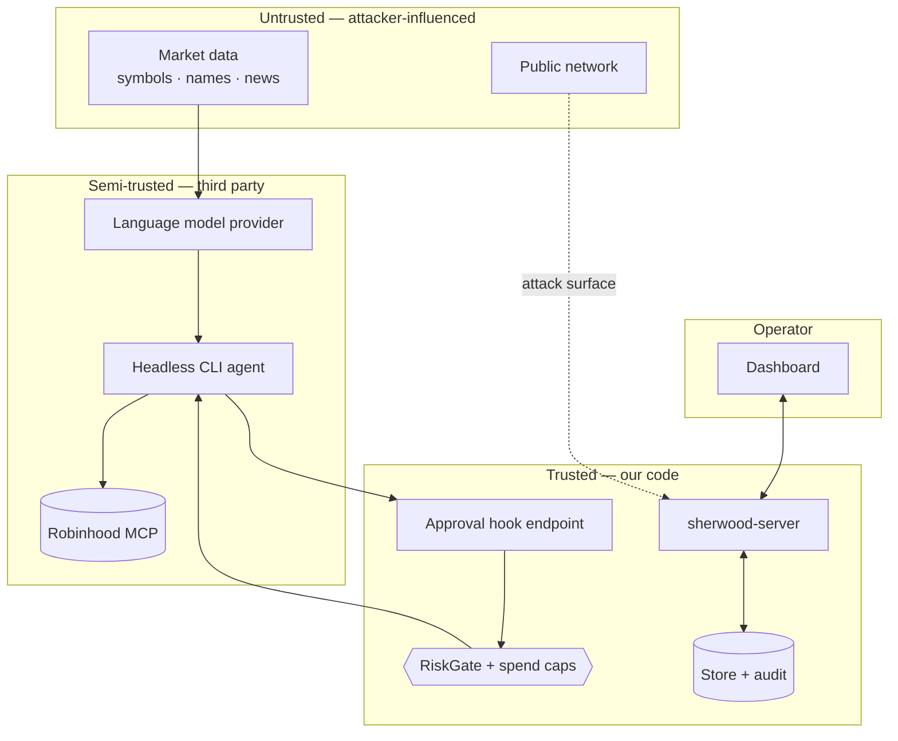

# Threat model

STRIDE over the v0.1 pipeline. Draft — signed off at S15 against the implemented system, not
the planned one.

## Scope and trust boundaries

Three boundaries matter most:

1. **Market data → model.** Attacker-controlled text entering a reasoning system.
2. **Agent → hook.** The only barrier between a non-deterministic actor and a funded account.
3. **Network → local server.** A web app on the operator's machine.

## Assets

| Asset | Why it matters |
|---|---|
| The funded Robinhood account | Direct financial loss |
| OAuth grant / API keys | Impersonation, unbounded trading |
| Local API token | Full control of the system, including the live toggle |
| The audit log | Evidence; loss of it means loss of accountability |
| Config (risk caps, allowlists) | Weakening these silently removes every protection |

## STRIDE

### Spoofing

| Threat | Mitigation |
|---|---|
| Forged hook calls impersonating the agent | Local token on every hook call, constant-time compare; unauthenticated calls denied and alerted |
| Attacker reaches the dashboard API | Loopback bind, bearer token, rate limiting, RBAC |
| A malicious or substituted MCP endpoint | Endpoint URL is config, not model-supplied; TLS validation via `rustls` with platform roots. *Certificate pinning is deliberately not used* — Robinhood rotates certificates and pinning would convert a routine rotation into an outage |
| Spoofed market data | Staleness detection; cross-check against a second source before acting on an unusual move; halt on divergence |

### Tampering

| Threat | Mitigation |
|---|---|
| Audit log edited or truncated | Hash-chained rows (`hash = sha256(prev_hash ‖ data)`); verification command; no `Store` method updates or deletes an audit row |
| Config silently weakened | Config changes emit `ConfigChanged` and are written to the audit log with before/after |
| Database file modified out of band | SQLCipher or full-disk encryption; hash-chain verification detects audit tampering regardless |
| Dependency compromise | `cargo-deny`, `cargo-audit`, committed lockfiles, SBOM, pinned versions |

### Repudiation

| Threat | Mitigation |
|---|---|
| "The bot did it, not me" / unclear provenance | Every decision, gate result, approval, submission and fill is logged with a correlation id, the actor (rule, model, operator), a timestamp, and — for model decisions — the full prompt and raw response |
| Approval ambiguity | Approval state machine records who approved, when, and from which session |

### Information disclosure

| Threat | Mitigation |
|---|---|
| Secrets in logs or error strings | Redaction layer; secret types zero on drop and print `[redacted]`; secrets never formatted into errors |
| Secrets returned by the API | Secrets are write-only; no endpoint returns one |
| Public repository revealing the security design | Recommendation to run private until hardened — see [SECURITY.md](SECURITY.md#disclosure-posture) |
| Model provider receives portfolio data | Send the minimum context necessary; document exactly what is transmitted; never send account numbers or credentials |

### Denial of service

| Threat | Mitigation |
|---|---|
| Venue or MCP unavailable mid-strategy | Fail closed — no new orders while the session is down beyond a threshold; exponential backoff; alert |
| Event bus saturation | Bounded queue, documented backpressure, `BackpressureWarning`; audit writes stay synchronous so they are never dropped |
| Model returns an enormous or slow response | Token budget ceiling, response size cap, hard timeout, per-run cost budget |
| Rate limits exhausted by a runaway loop | Shared quota manager across all consumers; per-run order and duration budgets with hard stops |
| Operator locked out during an incident | Kill switch has a filesystem path that does not depend on the server being healthy |

### Elevation of privilege

| Threat | Mitigation |
|---|---|
| A strategy or model causes an order that skips the gate | Architectural invariant: the executor is only reachable past the gate; enforced by module boundaries and a review checklist item |
| Agent calls an ungated venue tool | **Tool allowlist** — unrecognised tool names are denied, not passed through |
| `viewer` performs an operator action | RBAC middleware; live toggle and kill switch additionally require re-authentication |
| Prompt injection escalates model authority | Model output is data, never instructions; strict schema; the model cannot alter config, caps, or mode — see [AI-SAFETY.md](AI-SAFETY.md) |

## Model- and agent-specific threats

Under [ADR-0001](adr/0001-mcp-interaction-model.md) Option 3, a general-purpose coding agent
holds the venue connection. That is a substantially larger trust grant than a constrained
API client, and it deserves naming:

| Threat | Mitigation |
|---|---|
| The agent takes an action the operator never asked for | Fail-closed hook on every venue tool; allowlist; approval gate; per-run budgets |
| The agent is steered by injected content in market data | AI-safety controls; the gate does not trust the reason string; caps bound the damage |
| The agent's own credentials or environment are compromised | Agent runs with a minimal environment; no unrelated credentials in scope; the account it can reach is the Agentic account only |
| The agent retries around a denial | Denials are recorded; repeated denials within a window trip an alert and then the kill switch |

## Residual risks — accepted for v0.1

- A correct-looking but bad trading decision within all configured limits. This is market
  risk, not a security control failure; caps bound it, nothing prevents it.
- Compromise of the operator's machine defeats every control listed here.
- Robinhood-side outages or errors can leave local and remote state divergent until
  reconciliation runs.

## Sign-off

This document is `draft` until S15, when it is reviewed against the built system and every
mitigation is confirmed implemented or explicitly re-accepted as a residual risk.
