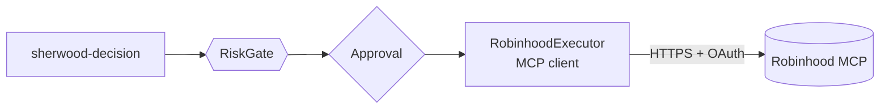
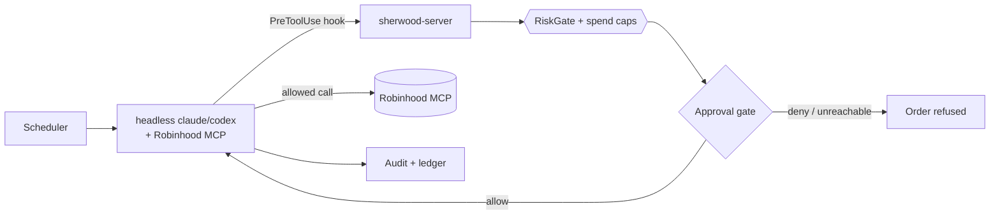

# ADR-0001 — MCP interaction model

## Context

v0.1 executes trades through the **Robinhood Agentic Trading MCP**. Per Robinhood's
documentation the server is:

- **Remote**, at `https://agent.robinhood.com/mcp/trading` — not a local process.
- **Streamable HTTP** transport (`claude mcp add robinhood-trading --transport http …`).
- **OAuth-authenticated**, with consent completed in a desktop browser, and an Agentic
  account opened during that same flow.
- Granting **read** access to accounts, positions, balances, order history and watchlists,
  and **write** access limited to placing and cancelling orders in the Agentic account.
- Open to third-party clients: *"You can connect to the Robinhood Trading MCP on other AI
  platforms that support MCP connections."*

What is **not** established is how `sherwood-agent` reaches it. Three plausible shapes exist,
plus one that avoids MCP entirely. This decision determines whether `sherwood-decision` is on
the v0.1 critical path at all, whether OAuth credentials ever touch our code, and roughly how
much of S7–S8 is ours to build.

An earlier draft of this decision assumed the MCP server would be launched as a managed
stdio subprocess. That is incorrect and is recorded here so it is not repeated.

## Decision drivers

- **The risk gate must remain unconditional.** Whatever the shape, no order may reach
  Robinhood without passing `RiskGate::check`.
- **Credentials should stay out of our codebase** if that is achievable at reasonable cost.
- **Time to a working v0.1.**
- **Whether the operator wants their own decision engine** (deterministic rules, NVIDIA
  prompts they control) or is content with a general-purpose coding agent deciding.
- **Backtestability.** A strategy expressed as an LLM prompt cannot be replayed against
  historical data; one expressed as code can.
- **Reversibility.** How expensive is it to change this later?

## Options

### Option 1 — sherwood as an MCP client

`sherwood-agent` implements an MCP client and calls the Robinhood MCP over authenticated
Streamable HTTP. `sherwood-decision` runs our own deciders; `RobinhoodExecutor` translates an
approved `Order` into MCP tool calls.

- **Good:** total control; our deciders and prompts; deterministic and backtestable; one
  process; the gate sits naturally in-line.
- **Bad:** we implement MCP client plumbing and the OAuth flow ourselves; **unverified** that
  Robinhood's consent flow will authorise a client we wrote; OAuth tokens become our custody
  problem; largest S7–S8 surface.
- **Risk:** if Robinhood's OAuth rejects non-listed clients, this option collapses late.

### Option 2 — sherwood as an agent harness

`sherwood-agent` never speaks MCP. It spawns a headless `claude` or `codex` process with the
Robinhood MCP configured in that agent's own config, hands it a strategy prompt, and
supervises the run. This is the shape used by OpenTrade-Agent.

- **Good:** proven; OAuth stays entirely inside the CLI agent's own credential store; very
  little integration code; Robinhood already lists Claude Code and Codex as supported.
- **Bad:** the "strategy" becomes a prompt, not code — not backtestable, not deterministic;
  `sherwood-decision` is sidelined; we inherit the agent's latency, cost, and failure modes;
  **the risk gate has no natural in-line position**, because the agent calls the MCP directly.

### Option 3 — agent harness with an in-line gate (recommended)

Option 2's process model, plus a `PreToolUse` hook on the agent's Robinhood order tools. The
hook posts the pending tool call back to `sherwood-server`, which runs `RiskGate::check`, the
spend caps, and the approval gate, and returns allow or deny. The hook **fails closed**: if
sherwood is unreachable, the order is denied.

- **Good:** everything in Option 2, and the gate becomes unconditional again; smallest path to
  a working v0.1; no credential custody; the ops shell (S9–S13) is the same either way; the
  `Executor` seam stays intact so Option 1 can be added later as a second mode.
- **Bad:** the decision quality depends on the agent, not our code; still not backtestable in
  v0.1; the hook contract is a coupling to the agent CLI's interface; reconciliation of the
  ledger relies on polling Robinhood's order ledger rather than observing our own submissions.

### Option 4 — direct REST API, no MCP

- **Good:** no MCP dependency at all.
- **Bad:** Robinhood's official public API for this is limited or absent; the unofficial API
  is fragile and carries terms-of-service risk. **Rejected.**

## Decision

**Proposed: Option 3.**

Ship v0.1 as an agent harness with the risk gate enforced in-line through a fail-closed
`PreToolUse` hook. Keep the `Executor` and `Decider` traits intact so that **Option 1 becomes
a drop-in second mode** once (a) it is confirmed that Robinhood's OAuth will authorise a
custom client, and (b) there is a reason to prefer our own decision engine over the agent's.

This is not yet accepted. The operator has stated an interest in an NVIDIA-driven decision
layer, which is an argument for Option 1. That tension is real and is the reason this ADR
remains `proposed`.

## Consequences

**If Option 3 is accepted:**

- S7 shrinks to: agent process supervision, the hook endpoint, tool allowlisting, and order
  reconciliation against Robinhood's ledger. The MCP client work disappears.
- `sherwood-decision` and `NvidiaDecider` move off the v0.1 critical path — they remain in
  paper mode and become the foundation of the Option 1 mode later.
- S14's backtest harness can only exercise `RuleDecider`, not the live decision path. This
  must be stated plainly in the backtest documentation so results are not over-read.
- A new dependency appears: the operator must have `claude` or `codex` installed and
  authenticated, with the Robinhood MCP connected in that CLI.
- The hook is security-critical. It is the only thing standing between the agent and the
  venue, and it must be treated as such — see [THREAT-MODEL.md](../THREAT-MODEL.md).

**If Option 1 is chosen instead:** S7–S8 grow by an MCP client, an OAuth implementation, and
token custody; `SECURITY.md`'s credential section becomes materially larger; and the project
takes on the risk that Robinhood's consent flow refuses a custom client.

**Either way:** ADR-0002 (AI decision mode) depends on this outcome, and the ops shell
(S9–S13) is unaffected.

## Open items before acceptance

1. Confirm whether Robinhood's OAuth consent authorises arbitrary MCP clients.
2. Confirm the exact tool names exposed by the Robinhood MCP, for the allowlist in S7.2.
3. Confirm the operator's preference: their own decision engine, or the agent's.
